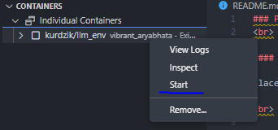
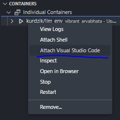

### Projects based on Transformers architecture
 

#### Projects description

placeholder

 

#### How to use this repo (Docker)
1. Make sure docker is installed
2. Start container
2.1 (Windows) Run: ` docker run -it --restart unless-stopped --name llm_developer_env --volume <absolute path to this repo>:/projects/ kurdzik/llm_env:latest`
2.2 (linux/mac) Run: ` docker run -it --restart unless-stopped --name llm_developer_env --volume $(pwd):/projects/ kurdzik/llm_env:latest`

3. **OPTIONAL** attach VS Code to a running container:
3.1 Install Docker extesion in VS Code
3.2 Start container 
3.3 Attach container 